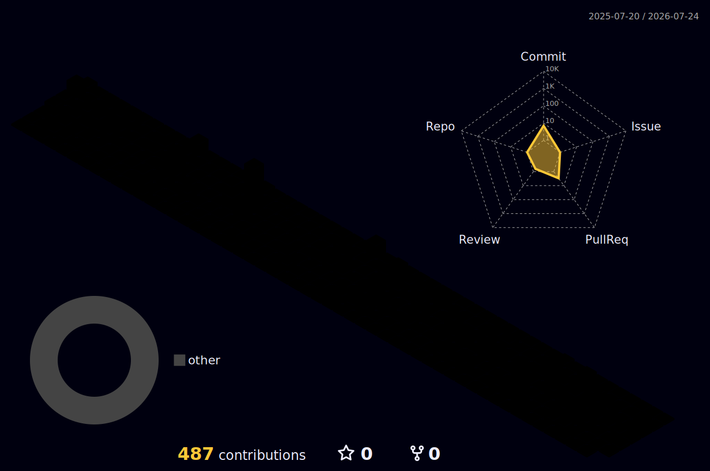
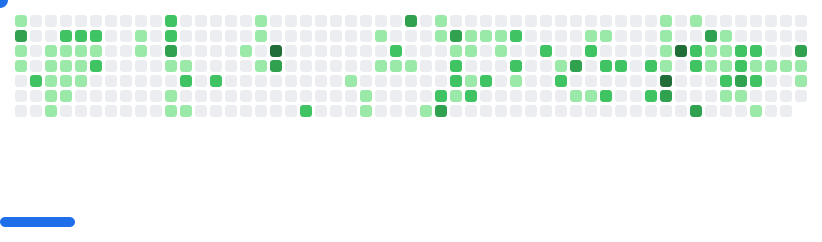

<div align="center">


<a href="https://git.io/typing-svg">
  
</a>

<br />

<a href="https://www.linkedin.com/in/themircn/">
  
</a>
<a href="https://instagram.com/themircnn">
  
</a>
<a href="https://stackoverflow.com/users/23795870">
  
</a>


</div>

---

## `> whoami`

```typescript
const emircan = {
  role: "Software Developer",
  location: "Konya, Türkiye",
  focus: [
    "Scalable frontend architectures",
    "Location and routing technologies",
    "Secure backend systems",
    "AI-powered developer workflows",
  ],
  principle: "Make it work. Make it clean. Make it scale.",
};
```

I build modern web platforms, map-based products and automation systems. I care about clean architecture, performance, security and developer experience—not just making software work, but making it survive growth.

---

## Tech Arsenal

<div align="center">

### Frontend


### Backend & Data


### Infrastructure & Tools


</div>

---

## Current Mission

```text
01. Designing scalable React and TypeScript architectures
02. Building map, geocoding and route-planning experiences
03. Developing secure permission and authentication systems
04. Automating repetitive engineering workflows with AI
05. Turning operational chaos into maintainable software
```

---

## GitHub Dashboard

<div align="center">


</div>


---

## 3D Contribution World

<div align="center">



</div>

---

## Contribution Games

### Pac-Man

<picture>
  <source media="(prefers-color-scheme: dark)" srcset="https://raw.githubusercontent.com/thEmircn/thEmircn/output/pacman-contribution-graph-dark.svg" />
  <source media="(prefers-color-scheme: light)" srcset="https://raw.githubusercontent.com/thEmircn/thEmircn/output/pacman-contribution-graph.svg" />
  
</picture>

### Breakout

<picture>
  <source media="(prefers-color-scheme: dark)" srcset="images/breakout-dark.svg" />
  <source media="(prefers-color-scheme: light)" srcset="images/breakout-light.svg" />
  
</picture>

---

## Terminal Mode

<div align="center">

[](https://github.com/thEmircn)

</div>

---

## Featured Projects

<table>
<tr>
<td width="50%" valign="top">

### [Yerlem WebSite](https://github.com/thEmircn/Yerlem-WebSite)

A location-technology focused web platform built around modern user experiences and operational workflows.

`React` `JavaScript` `Maps` `Location Technologies`

</td>
<td width="50%" valign="top">

### [Müşteri Takip v2](https://github.com/thEmircn/Musteri-Takip-v2)

A customer management application focused on practical business workflows and maintainable UI architecture.

`Web Development` `Business Automation` `CRUD`

</td>
</tr>
<tr>
<td width="50%" valign="top">

### [Kitap Mağaza Stok Takip](https://github.com/thEmircn/Kitap-Magaza-Stok-Takip)

Inventory management project for tracking books, products and operational stock movements.

`Inventory` `Database` `Automation`

</td>
<td width="50%" valign="top">

### [Kütüphane Sistemi](https://github.com/thEmircn/KutuphaneSistemi)

A library management system designed to organize books, users and borrowing processes.

`Management System` `Database` `Software Design`

</td>
</tr>
</table>

---

<div align="center">

> **Design systems that survive growth. Write code your future self can understand.**


</div>
