<div align="center">


<a href="https://git.io/typing-svg">
  
</a>

<br />

<a href="https://www.linkedin.com/in/themircn/">
  
</a>
<a href="https://instagram.com/themircnn">
  
</a>
<a href="https://stackoverflow.com/users/23795870">
  
</a>


</div>

---

## `> whoami`

```typescript
const emircan = {
  role: "Yazılım Geliştiricisi",
  location: "Konya, Türkiye",
  focus: [
    "Ölçeklenebilir React ve TypeScript mimarileri",
    "Konum, harita, geocoding ve rotalama teknolojileri",
    "Güvenli Java ve Spring Boot arka uç sistemleri",
    "PostgreSQL, PostGIS ve veri odaklı uygulamalar",
    "Yapay zekâ destekli geliştirici otomasyonları",
  ],
  principle: "Çalıştır. Temizle. Güçlendir. Ölçeklendir.",
};
```

Ben yalnızca ekran geliştiren bir frontend geliştiricisi değilim. Kullanıcı deneyiminden veri tabanına, yetkilendirme mimarisinden Docker altyapısına, harita tabanlı operasyonlardan yapay zekâ otomasyonlarına kadar ürünün tamamını anlayarak hareket ederim.

Gerçek hayattaki karmaşık operasyonları analiz eder; hızlı, güvenli, sürdürülebilir ve büyümeye hazır yazılım sistemlerine dönüştürürüm. Hedefim yalnızca çalışan kod yazmak değil, yıllar sonra bile geliştirilebilir kalan güçlü ürünler ortaya çıkarmaktır.

> **“Hayatta en hakiki mürşit ilimdir, fendir.” — Mustafa Kemal Atatürk**

---

## Teknoloji Cephaneliğim

<div align="center">

### Frontend


### Backend & Data


### Infrastructure & Tools


</div>

---

## Current Mission

```text
01. Büyük React projelerinde sürdürülebilir ve modüler mimariler kurmak
02. Harita, geocoding ve rota planlama sistemlerini ileri taşımak
03. Güvenli yetkilendirme ve kimlik doğrulama altyapıları geliştirmek
04. Tekrarlayan mühendislik işlerini yapay zekâ ajanlarıyla otomatikleştirmek
05. Operasyonel karmaşayı ölçülebilir ve yönetilebilir yazılıma dönüştürmek
06. Yük altında dahi güvenilirliğini koruyan sistemler tasarlamak
```

> **“Türk; öğün, çalış, güven.” — Mustafa Kemal Atatürk**

---

## GitHub Command Center

<div align="center">









</div>

---

## 3D Contribution World

<div align="center">


</div>

---

## Contribution Games

### Pac-Man

<p align="center">
  <picture>
    <source media="(prefers-color-scheme: dark)" srcset="./images/pacman-contribution-graph-dark.svg" />
    <source media="(prefers-color-scheme: light)" srcset="./images/pacman-contribution-graph.svg" />
    
  </picture>
</p>

### Breakout

<p align="center">
  <picture>
    <source media="(prefers-color-scheme: dark)" srcset="./images/breakout-dark.svg" />
    <source media="(prefers-color-scheme: light)" srcset="./images/breakout-light.svg" />
    
  </picture>
</p>

---

## Terminal Mode

<div align="center">

[](https://github.com/thEmircn)

</div>

---

## Öne Çıkan Projeler

<table>
<tr>
<td width="50%" valign="top">

### [Yerlem WebSite](https://github.com/thEmircn/Yerlem-WebSite)

Konum teknolojileri, operasyon yönetimi ve modern kullanıcı deneyimini bir araya getiren kapsamlı bir web platformu. Harita tabanlı süreçleri yönetilebilir ve ölçeklenebilir ürün deneyimlerine dönüştürür.

`React` `JavaScript` `Harita` `Konum Teknolojileri`

</td>
<td width="50%" valign="top">

### [Müşteri Takip v2](https://github.com/thEmircn/Musteri-Takip-v2)

Müşteri süreçlerini düzenleyen, günlük iş yükünü azaltan ve işletme operasyonlarını merkezi hale getiren sürdürülebilir bir yönetim uygulaması.

`Web Geliştirme` `İş Otomasyonu` `Yönetim Sistemi`

</td>
</tr>
<tr>
<td width="50%" valign="top">

### [Kitap Mağaza Stok Takip](https://github.com/thEmircn/Kitap-Magaza-Stok-Takip)

Kitap, ürün ve stok hareketlerini güvenilir şekilde izleyen; veri bütünlüğünü ve operasyonel kontrolü merkeze alan bir stok yönetim sistemi.

`Stok Yönetimi` `Veri Tabanı` `Otomasyon`

</td>
<td width="50%" valign="top">

### [Kütüphane Sistemi](https://github.com/thEmircn/KutuphaneSistemi)

Kitapları, kullanıcıları ve ödünç süreçlerini tek merkezden yöneten; düzenli veri modeli ve anlaşılır iş akışları üzerine kurulmuş bir yönetim sistemi.

`Yönetim Sistemi` `Veri Tabanı` `Yazılım Tasarımı`

</td>
</tr>
</table>

---

<div align="center">

### **“Ne mutlu Türk'üm diyene!”**

> **Büyümeye dayanıklı sistemler tasarla. Gelecekteki halinin anlayabileceği kodlar yaz.**


</div>
